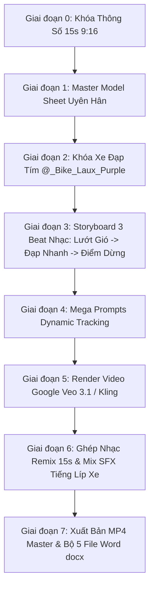

# TIẾN TRÌNH SẢN XUẤT: ĐẠP XE ĐÊM THÀNH PHỐ (15S VIRAL SHORTS)
### Kênh: Uyên Hân Sport • Chuẩn Đồng Bộ Nhạc Remix "Gió Cuốn Theo Chiều Xuống"

```mermaid
graph TD
    A[Giai đoạn 0: Khóa Thông Số 15s 9:16] --> B[Giai đoạn 1: Master Model Sheet Uyên Hân]
    B --> C[Giai đoạn 2: Khóa Xe Đạp Tím @_Bike_Laux_Purple]
    C --> D[Giai đoạn 3: Storyboard 3 Beat Nhạc: Lướt Gió -> Đạp Nhanh -> Điểm Dừng]
    D --> E[Giai đoạn 4: Mega Prompts Dynamic Tracking]
    E --> F[Giai đoạn 5: Render Video Google Veo 3.1 / Kling]
    F --> G[Giai đoạn 6: Ghép Nhạc Remix 15s & Mix SFX Tiếng Líp Xe]
    G --> H[Giai đoạn 7: Xuất Bản MP4 Master & Bộ 5 File Word docx]
```
